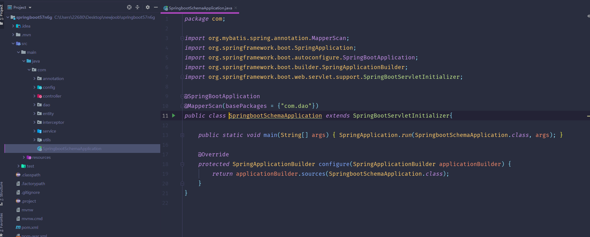
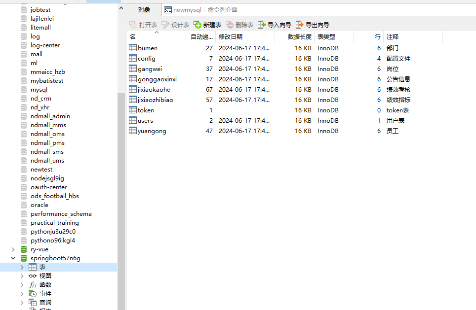
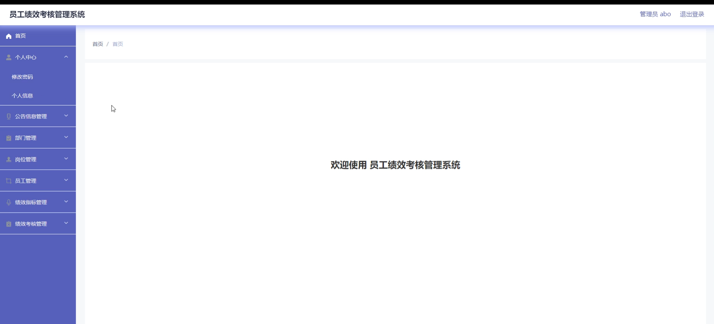
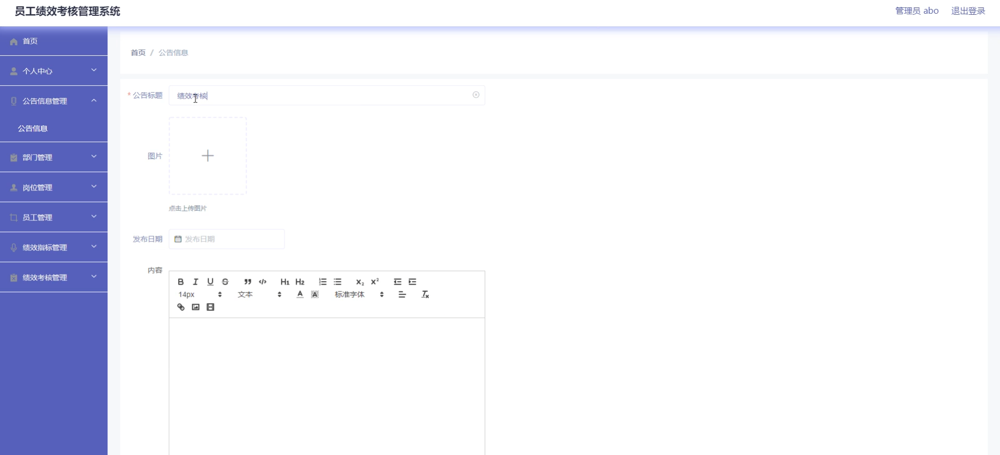
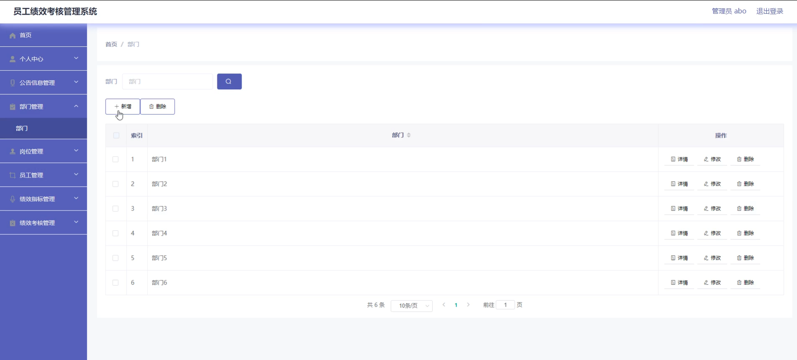
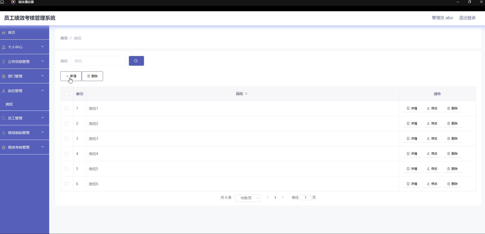
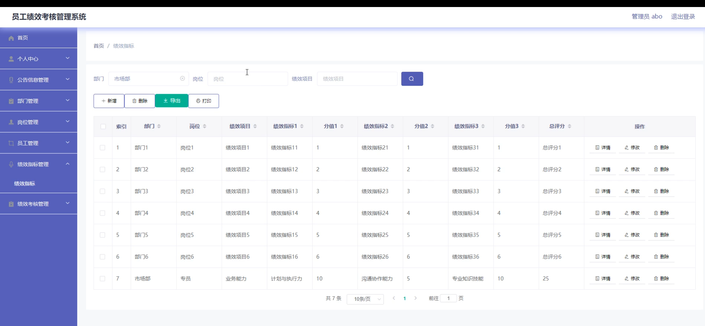
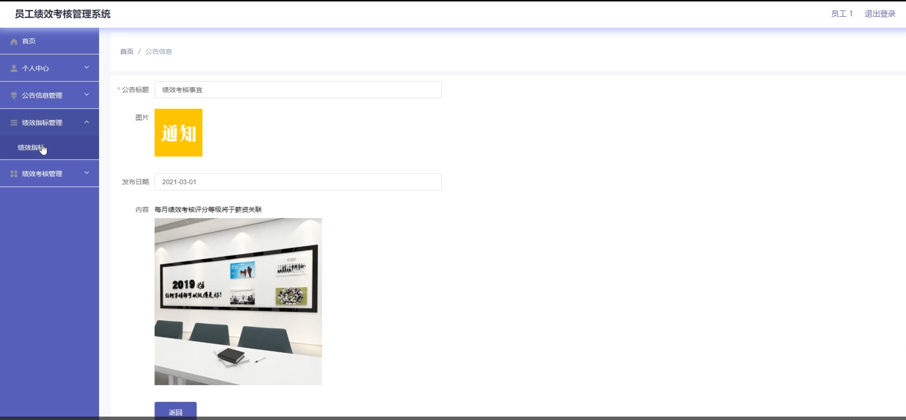
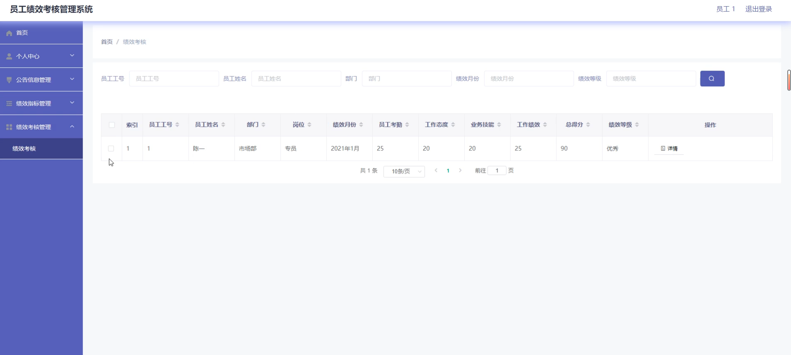

# 基于SSM的月度员工绩效考核管理系统

#### 介绍

本房屋租赁系统旨在为管理人员和员工提供一个高效、安全、便捷的工作平台。系统通过信息化手段，简化房屋租赁相关的管理流程，提高工作效率，确保信息透明和准确。系统设有两种角色：管理端和员工端，各角色分别拥有不同的功能模块，以满足各自的需求和职责。

#### 技术栈介绍

后端技术栈：Springboot+Mysql+Maven

前端技术栈：Vue+Html+Css+Javascript+ElementUI

开发工具：Idea+Vscode+Navicate

#### 系统功能介绍

1. 管理端

管理端是系统的核心，负责平台的整体管理和维护，确保平台的正常运行和信息的真实性。管理端功能模块包括：

个人中心：管理员可以管理个人信息，修改密码等。

公告信息管理：发布和管理平台公告，确保重要信息及时传达给所有员工。

部门管理：创建和管理部门信息，包括新增、修改和删除部门，设置部门职责。

岗位管理：管理岗位信息，定义岗位职责和要求，为员工分配合适的岗位。

员工管理：管理员工信息，包括员工的录入、修改、删除和查询，进行员工档案的维护。

绩效指标管理：制定和管理员工绩效考核指标，设置考核标准和目标。

绩效考核管理：执行和管理员工绩效考核，记录考核结果，分析员工绩效，提供反馈和改进建议。

2. 员工端

员工端为员工提供个人信息管理和工作绩效管理的功能。员工端功能模块包括：

个人中心：员工可以管理个人信息，修改密码，查看和编辑个人档案。

公告信息管理：查看平台发布的公告信息，了解最新动态和通知。

绩效指标管理：查看自己需要完成的绩效指标，了解考核标准和目标，合理安排工作。

绩效考核管理：查看自己的绩效考核结果，获取反馈，提升工作效率和质量。

#### 平台作用

1. 对管理员的作用

高效的员工管理：管理人员可以通过平台方便地管理和维护员工信息，提升管理效率。

透明的绩效考核：通过系统制定和管理绩效考核指标，确保考核过程公开、公正，提升员工工作积极性。

便捷的信息发布：管理人员可以通过公告模块及时发布和管理重要信息，确保信息传达的及时性和准确性。

科学的部门和岗位管理：系统化管理部门和岗位信息，合理分配工作职责，优化组织结构。

2. 对员工的作用

便捷的个人信息管理：员工可以通过平台随时查看和管理个人信息，保持个人档案的完整性和准确性。

清晰的绩效目标：员工可以查看自己的绩效指标和考核标准，明确工作目标，提升工作效率和质量。

及时的信息获取：通过公告模块，员工可以及时了解平台发布的公告和通知，保持信息同步。

透明的绩效反馈：员工可以查看自己的绩效考核结果，获取反馈，了解自身的工作表现，促进自我提升。

#### 系统功能截图

代码结构

数据库表

登录

1. 管理端

首页

公告信息管理

部门管理

岗位管理

绩效指标管理

2. 员工端

绩效指标管理

绩效考核

#### 总结

房屋租赁系统通过现代化的技术手段，为管理人员和员工提供了一个高效、安全、便捷的工作平台。系统不仅提升了管理和工作过程的效率，还通过信息化的管理和操作，实现了管理过程的透明化和标准化，确保了信息的准确性和真实性。平台的建立不仅为管理人员和员工带来了极大的便利和保障，同时也促进了组织内部的协调和高效运作，为房屋租赁业务的发展提供了坚实的支持。

#### 使用说明

创建数据库，执行数据库脚本 修改jdbc数据库连接参数 下载安装maven依赖jar 启动idea中的springboot项目

后台地址：http://localhost:8080/springboot57n6g/admin/dist/index.html

管理员  abo 密码 abo

